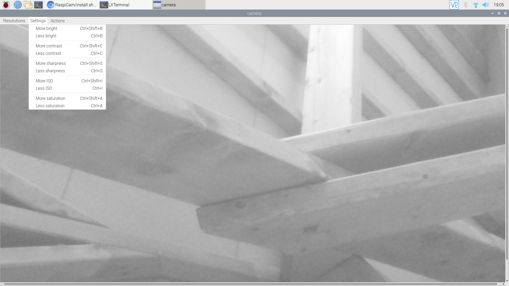
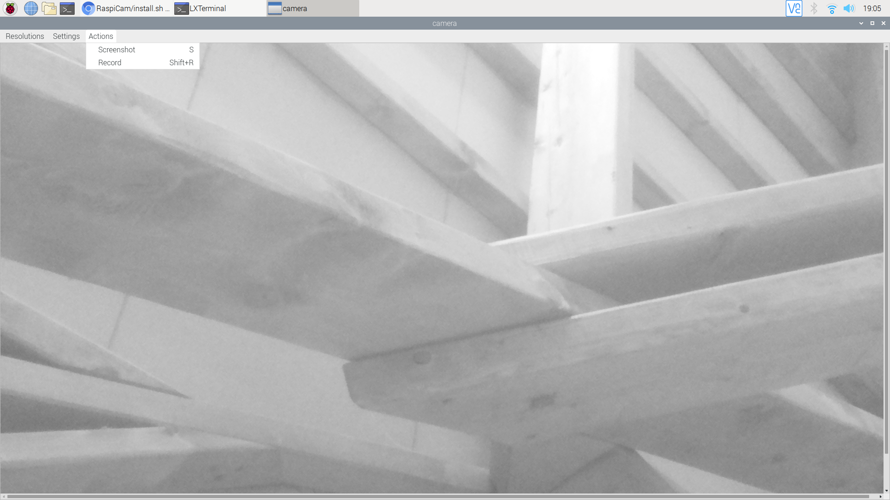

# RaspiCam

RaspiCam is a basic graphical user interface for the Raspberry Camera.

## Installation

``` 
wget https://raw.githubusercontent.com/bgallois/RaspiCam/master/client/install.sh
chmod +x install.sh
./install.sh
camera
```



